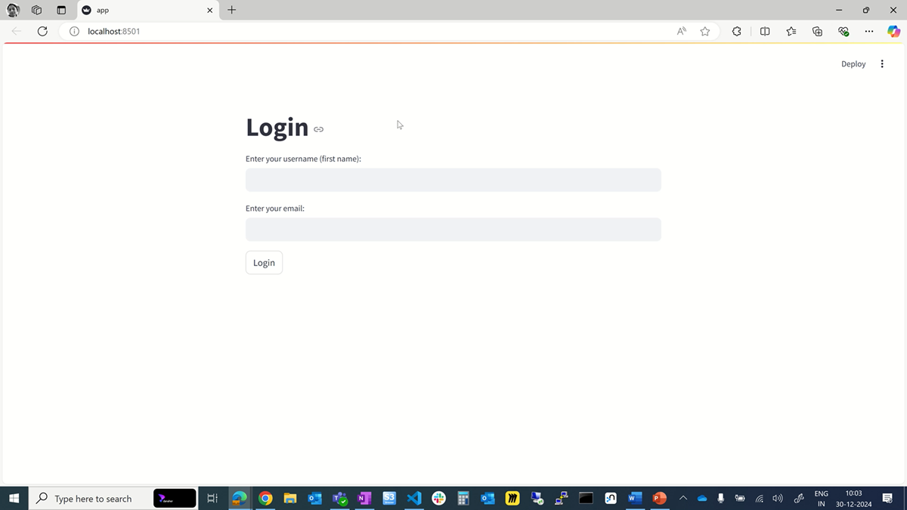

# Document Search System

This project is a multi-user document search system that allows users to log in and search for documents in specified folders. The system uses embeddings to create a vector store from the documents and provides a chatbot interface for querying the documents.

## Prerequisites

- Python 3.10 or higher
- Install the required Python packages:

  ```sh
  pip install streamlit langchain_openai langchain_huggingface langchain_chroma pyyaml

## Project Structure

```text
assignment/
├── data/
│   ├── documents/
│   │   ├── Selective Insurance/
│   │   ├── Home Bancorp/
│   │   ├── Citigroup/
│   │   ├── JPMorgan/
│   │   └── META/
│   └── vectorstore/
│       ├── Selective Insurance/
│       ├── Home Bancorp/
│       ├── Citigroup/
│       ├── JPMorgan/
│       └── META/
├── src/
│   ├── app.py
│   ├── bot.py
│   ├── config.yaml
│   ├── index.py
│   ├── prompt.py
│   └── utils.py
```

## Configuration

The configuration file `config.yaml` contains the folder paths, device settings, embedding model, and user information.

## Steps to Test the Solution

1. Build the Vector Store
   
Run the `index.py` script to build the vector store from the documents in the specified folders.

```bash
python assignment/src/index.py
```

2. Start the Streamlit Application
   
Run the `app.py` script to start the Streamlit application.

```bash
streamlit run app.py
```

3. Log In
   
Open the Streamlit application in your web browser.
Enter your username (first name) and email to log in.
Click the "Login" button.

4. Use the Chatbot
   
After logging in, you will be redirected to the chatbot page.
Enter your query in the text input field.
Click the "Submit Query" button to get the response from the chatbot.

## Example Usage

Log in as "alice" with the email <alice@email.com>.
Enter a query such as "What are the latest updates in META documents?".
The chatbot will respond with the relevant information from the documents.



### Login Use case videos
1. Successful Login Case :  `successful_login_case.mp4` video file.
2. Failed Login Case: `failed_login_case.mp4` video file


## Additional Information

1. The utils.py file contains utility functions for reading the configuration file and retrieving user information.
2. The bot.py file contains functions for creating the retrieval chain and generating responses.
3. The prompt.py file contains the system prompt template for the chatbot.

## Troubleshooting

1. Ensure that the configuration file config.yaml is correctly set up with the folder paths and user information.
2. Make sure that the required Python packages are installed.
   